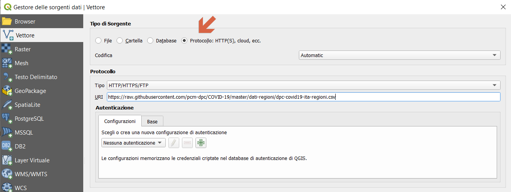
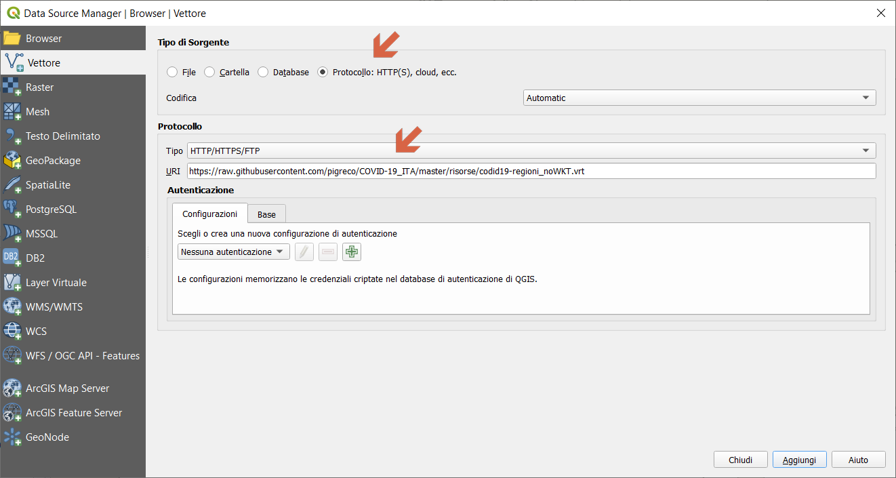
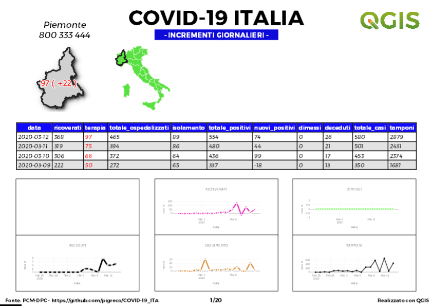

<!-- TOC -->

- [Perché questo spazio](#perch%c3%a9-questo-spazio)
- [File di progetto QGIS](#file-di-progetto-qgis)
- [Cosa c'è in questo repo](#cosa-c%c3%a8-in-questo-repo)
- [Espressione usata](#espressione-usata)
- [Virtual layer](#virtual-layer)
- [Virtual File Format di GDAL/OGR](#virtual-file-format-di-gdalogr)
- [Atlas](#atlas)
- [Usare gli Stemmi delle Regioni Italiane](#usare-gli-stemmi-delle-regioni-italiane)
- [Riferimenti utili](#riferimenti-utili)

<!-- /TOC -->

[](https://github.com/pigreco/COVID-19_ITA/blob/master/license)
[](https://github.com/pigreco/COVID-19_ITA/commits/master)

## Perché questo spazio

- **ITA** : Progetto QGIS per la visualizzazione dei dati COVID-19 attraverso un atlas con grafici dinamici - regioni ISTAT - fonte : https://github.com/pcm-dpc/COVID-19
- **ENG** : QGIS project for the visualization of COVID-19 data through an atlas with dynamic graphs - regions ISTAT - source : https://github.com/pcm-dpc/COVID-19

## File di progetto QGIS

I file di progetto **QGIS** (`COVID19_3857_noVL_ogrVRT_provaut`) utilizzano come fonte dati il file [`dpc-covid19-ita-regioni.csv`](https://raw.githubusercontent.com/pcm-dpc/COVID-19/master/dati-regioni/dpc-covid19-ita-regioni.csv) presente nel repository ufficiale del [`PCM-DPC`](https://github.com/pcm-dpc/COVID-19) tramite Protocollo `HTTPS`, quindi il file si aggiorna automaticamente:



Il file di progetto (`COVID19_3857_noVL_ogrVRT.qgs`) utilizza come fonte dati il file [`dpc-covid19-ita-regioni.csv`](https://raw.githubusercontent.com/pcm-dpc/COVID-19/master/dati-regioni/dpc-covid19-ita-regioni.csv) presente nel repository ufficiale del [`PCM-DPC`](https://github.com/pcm-dpc/COVID-19) tramite file `codid19-regioni_noWKT.vrt` (source un [Virtual File Format](https://gdal.org/drivers/vector/vrt.html#virtual-file-format) di GDAL/OGR), quindi il file si aggiorna automaticamente.

---

**NB:** il file di progetto è stato realizzato con [`QGIS 3.12 București`](https://qgis.org/it/site/) e Plugin [`DataPlotly 3.5`](https://github.com/ghtmtt/DataPlotly)

---

## Cosa c'è in questo repo

- cartella `imgs` contiene le immagini utilizzate nel progetto .qgs;
- cartella `risorse` contiene i file utilizzati nel progetto, come:
  - `nroVerdeEmergenzaCOVID19.csv` è una tabella con i numeri verdi regionali per emergenza sanitaria;
  - `nroVerdeEmergenzaCOVID19.csvt` file di servizio per definire la tipologia di campi;
  - shapefile `reg_istat3857.*` limiti amministrativi regionali ISTAT 2019, EPSG:3857;
  - shapefile* `reg_provaut3857.*` limiti amministrativi regionali ISTAT 2019 con Prov. Autonome Trento e Bolzano, EPSG:3857, file modificato manualmente;
  - file `codid19-regioni.vrt` Virtual File Format GDAL/OGR con file CSV raw da GitHub, con geometry Point;
  - file `codid19-regioni_noWKT.vrt` Virtual File Format GDAL/OGR con file CSV raw da GitHub, no geometry;
  - file `codid19-regioni_dw.vrt` collegato a data.word, ma non funziona in QGIS;
  - file `config_grafici_casi_totali.xml` di configurazione grafici atlas;
  - file `COVID19_3857_noVL_ogrVRT_provaut.qpt` modello layouts;
  - file `stemmi_regione.csv` stemmi regionali;
  - file `world_map.gpkg` geopackage con la world map;
- file `COVID19_3857_noVL.qgs` è il file di progetto QGIS in formato `.qgs` (senza usare Virtual layer), EPSG:3857;
- file `COVID19_3857.qgs` è il file di progetto QGIS in formato `.qgs` (usa Virtual layer), EPSG:3857;
- file `COVID19_3857_noVL_ogrVRT.qgs` è il file di progetto QGIS in formato `.qgs`, EPSG:3857 (`OLD-main`), usa OGRVRT;
- file `COVID19_3857_noVL_ogrVRT_provaut.qgs` è il file di progetto QGIS in formato `.qgs`, EPSG:3857 (`main`), usa OGRVRT;
- file `license` è il file che definisce la licenza del repository;
- file `README.md` è questo file, con le info.

\* lo shapefile è stato modificato manualmente, è stata eliminata la regione e aggiunti le due province autonome.

[↑ torna su ↑](#perch%c3%a9-questo-spazio)

## Espressione usata

Per calcolo valori incrementali giornalieri è stata usata la seguente espressione nel Campo Y dei grafici `Scatter Plot`

```
with_variable(
'my_exp', 
array_find(  
array_agg( 
expression:= "data" , group_by:= "codice_regione" ,
order_by:="data"),"data"),
if( 
to_int(@my_exp) = 0, 
(array_agg( 
            expression:=  "terapia_intensiva" , 
            group_by:= "codice_regione" ,
            order_by:=  "data"  )[0]),
("terapia_intensiva"  -
(array_agg( 
expression:= "terapia_intensiva", 
group_by:= "codice_regione" ,
order_by:=  "data"  )[to_int(@my_exp)-1]))))
```

PS: per maggiori info sull'espressione: <https://pigrecoinfinito.com/2020/03/10/qgis-creare-grafici-con-incrementi-giornalieri/>


[↑ torna su ↑](#perch%c3%a9-questo-spazio)

## Virtual layer

Layer : `virtual layer`

```sql
SELECT "codice_regione",
substr(data,1,10) as "data", 
sum(CAST ("ricoverati_con_sintomi" AS INT)) AS ricoverati,
sum(CAST ("deceduti" AS INT)) AS deceduti,
sum(CAST ("terapia_intensiva" AS INT)) AS terapia,
sum(CAST ("isolamento_domiciliare" AS INT)) AS isolamento,
sum(CAST ("dimessi_guariti" AS INT)) AS dimessi,
sum(CAST ("tamponi" AS INT)) AS tamponi,
sum(CAST("totale_casi" AS INT)) AS totale, count(*) as nro
FROM "dpc-covid19-ita-regioni"
GROUP BY 1,2;
```

Layer : `virtual layer complessivo`

```sql
SELECT 
substr(data,1,10) as "data", 
sum(CAST("totale_casi" AS INT)) AS totale,
sum(CAST("totale_attualmente_positivi" AS INT)) AS tot_att_pos,
sum(CAST("deceduti" AS INT)) AS deceduti,
sum(CAST("dimessi_guariti" AS INT)) AS guariti,
sum(CAST("terapia_intensiva" AS INT)) AS terapia,
sum(CAST("tamponi" AS INT)) AS tamponi
FROM "dpc-covid19-ita-regioni"
GROUP BY 1;
```

[↑ torna su ↑](#perch%c3%a9-questo-spazio)

## Virtual File Format di GDAL/OGR

link utile: <https://gdal.org/drivers/vector/vrt.html#virtual-file-format>

```xml
<OGRVRTDataSource>
<OGRVRTLayer name="dpc-covid19-ita-regioni">
    <SrcDataSource relativeToVRT="0">/vsicurl/https://raw.githubusercontent.com/pcm-dpc/COVID-19/master/dati-regioni/dpc-covid19-ita-regioni.csv</SrcDataSource>
    <Field name="data" type="String" />
    <Field name="lat" type="Real" />
    <Field name="long" type="Real" />
    <Field name="stato" type="String" />
    <Field name="codice_regione" type="String" />
    <Field name="denominazione_regione" type="String" />
	  <Field name="ricoverati_con_sintomi" type="Integer" />
    <Field name="terapia_intensiva" type="Integer" />
    <Field name="totale_ospedalizzati" type="Integer" />
    <Field name="isolamento_domiciliare" type="Integer" />
    <Field name="totale_attualmente_positivi" type="Integer" />
    <Field name="nuovi_attualmente_positivi" type="Integer" />
    <Field name="dimessi_guariti" type="Integer" />
    <Field name="deceduti" type="Integer" />
    <Field name="totale_casi" type="Integer" />
    <Field name="tamponi" type="Integer" />
</OGRVRTLayer>
</OGRVRTDataSource>
```

- per un quadro sinottico del file

```
ogrinfo codid19-regioni_dw.vrt dpc-covid19-ita-regioni -summary
```

- per leggere il file con OGR:

```
ogrinfo codid19-regioni_dw.vrt dpc-covid19-ita-regioni
```

per ottenere il nome layer corretto

```
ogrinfo -ro -al -q CSV:/vsicurl/https://raw.githubusercontent.com/pcm-dpc/COVID-19/master/dati-regioni/dpc-covid19-ita-regioni.csv
```

- per usarlo in QGIS:



## Atlas

Vettore di copertura : layer `reg_provaut3857`, Font [`TRUENO`](https://www.wfonts.com/font/trueno)


**Gif animata:**



[↑ torna su ↑](#perch%c3%a9-questo-spazio)

## Usare gli Stemmi delle Regioni Italiane

In questa pagina di [Wikipedia](https://it.wikipedia.org/wiki/Stemmi_delle_regioni_italiane) è presente una tabella con i nomi delle regioni e i relativi Stemmi. Per utilizzarli nell'Atlas ho creato un file CSV in [gsheet](https://docs.google.com/spreadsheets/d/10V0pjVjHrjZZFQG3uTrimsJ_yqmszBCIHTowYF-tOWE/edit?usp=sharing) e i comandi:

```
=IMPORTXML("https://it.wikipedia.org/wiki/Stemmi_delle_regioni_italiane";"//table[2]//td[1]")
```
- per il link

```
=IMPORTXML("https://it.wikipedia.org/wiki/Stemmi_delle_regioni_italiane";"//td/a/img/@src")
```
 ottenendo

 regioni|link_stemmi
-------|------
Abruzzo|//upload.wikimedia.org/wikipedia/commons/thumb/c/ce/Regione-Abruzzo-Stemma.svg/100px-Regione-Abruzzo-Stemma.svg.png
Basilicata|//upload.wikimedia.org/wikipedia/commons/thumb/0/07/Regione-Basilicata-Stemma.svg/100px-Regione-Basilicata-Stemma.svg.png
Calabria|//upload.wikimedia.org/wikipedia/commons/thumb/b/bf/Coat_of_arms_of_Calabria.svg/100px-Coat_of_arms_of_Calabria.svg.png
Campania|//upload.wikimedia.org/wikipedia/commons/thumb/a/a8/Regione-Campania-Stemma.svg/100px-Regione-Campania-Stemma.svg.png
Emilia-Romagna|//upload.wikimedia.org/wikipedia/commons/thumb/9/9c/Stemma_Emilia-Romagna.png/100px-Stemma_Emilia-Romagna.png
Friuli-Venezia Giulia|//upload.wikimedia.org/wikipedia/commons/thumb/6/6b/CoA_of_Friuli-Venezia_Giulia.png/100px-CoA_of_Friuli-Venezia_Giulia.png
.... |.....


## Riferimenti utili

- **QGIS** : <https://qgis.org/it/site/>
- **Plugin DataPlotly** : <https://github.com/ghtmtt/DataPlotly>
- **Fonti dati PCM-DPC** : <https://github.com/pcm-dpc/COVID-19>
- **CONFINI DELLE UNITÀ AMMINISTRATIVE A FINI STATISTICI AL 1 GENNAIO 2019** : <https://www.istat.it/it/archivio/222527>
- **Word Map** : <https://www.naturalearthdata.com/downloads/10m-cultural-vectors/>
- **Stemmi Regioni Italiane** : <https://it.wikipedia.org/wiki/Stemmi_delle_regioni_italiane>;
- **Font Trueno** : <https://www.wfonts.com/font/trueno>
- **Visual Style Guide** : <https://www.qgis.org/en/site/getinvolved/styleguide.html#trueno-fonts>


**NB:** Tutti i dati prodotti dall’Istituto nazionale di statistica (ISTAT) sono rilasciati sotto [licenza Creative Commons (CC BY 3.0 IT)](https://www.istat.it/it/note-legali): è possibile riprodurre, distribuire, trasmettere e adattare liberamente dati e analisi dell’Istituto nazionale di statistica, anche a scopi commerciali, a **condizione che venga citata la fonte**.


[↑ torna su ↑](#perch%c3%a9-questo-spazio)
