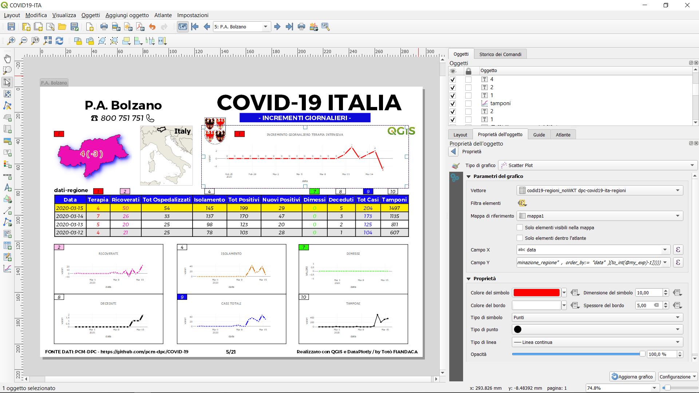
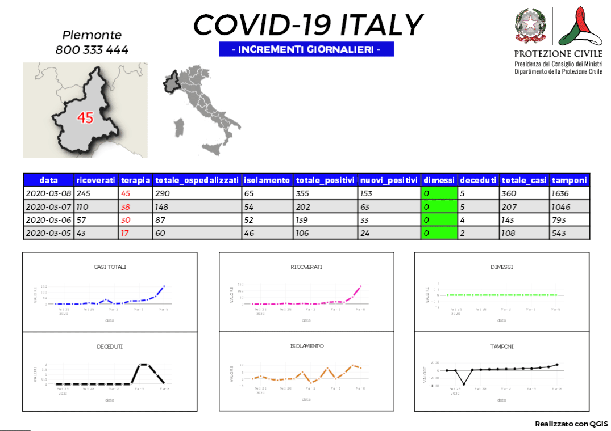

## In costruzione ...

<!-- TOC -->

- [In costruzione ...](#in-costruzione)
- [Perché questo spazio](#perch%c3%a9-questo-spazio)
- [File di progetto QGIS](#file-di-progetto-qgis)
- [Cosa c'è in questo repo](#cosa-c%c3%a8-in-questo-repo)
- [Espressione usata](#espressione-usata)
- [Virtual layer](#virtual-layer)
- [Atlas](#atlas)
- [Riferimenti utili](#riferimenti-utili)

<!-- /TOC -->

[](https://github.com/pigreco/COVID-19_ITA/blob/master/license)
[](https://github.com/pigreco/COVID-19_ITA/commits/master)

## Perché questo spazio

- **ITA** : Progetto QGIS per la visualizzazione dei dati COVID-19 attraverso un atlas con grafici dinamici - regioni ISTAT - fonte : https://github.com/pcm-dpc/COVID-19
- **ENG** : QGIS project for the visualization of COVID-19 data through an atlas with dynamic graphs - regions ISTAT - source : https://github.com/pcm-dpc/COVID-19

## File di progetto QGIS

I file di progetto **QGIS** (`COVID19_3857.qgs` e `COVID19_3857.qgs_noVL`) utilizzano come fonte dati il file [`dpc-covid19-ita-regioni.csv`](https://raw.githubusercontent.com/pcm-dpc/COVID-19/master/dati-regioni/dpc-covid19-ita-regioni.csv) presente nel repository ufficiale del [`PCM-DPC`](https://github.com/pcm-dpc/COVID-19) tramite Protocollo `HTTPS`, quindi il file si aggiorna automaticamente:


Il file di progetto (`COVID19_3857_noVL_ogrVRT.qgs`) utilizza come fonte dati il file [`dpc-covid19-ita-regioni.csv`](https://raw.githubusercontent.com/pcm-dpc/COVID-19/master/dati-regioni/dpc-covid19-ita-regioni.csv) presente nel repository ufficiale del [`PCM-DPC`](https://github.com/pcm-dpc/COVID-19) tramite file `codid19-regioni_noWKT.vrt` (source un [Virtual File Format](https://gdal.org/drivers/vector/vrt.html#virtual-file-format) di GDAL/OGR), quindi il file si aggiorna automaticamente.

**NB:** il file di progetto è stato realizzato con `QGIS 3.12 București`

## Cosa c'è in questo repo

- cartella `imgs` contiene le immagini utilizzate nel progetto .qgs;
- cartella `risorse` contiene i file utilizzati nel progetto, come:
  - `nroVerdeEmergenzaCOVID19.csv` è una tabella con i numeri verdi regionali per emergenza sanitaria;
  - `nroVerdeEmergenzaCOVID19.csvt` file di servizio per definire la tipologia di campi;
  - shapefile `reg_istat3857.*` limiti amministrativi regionali ISTAT 2019, EPSG:3857;
  - file `codid19-regioni.vrt` Virtual File Format GDAL/OGR con file CSV raw da GitHub, con geometry Point;
  - file `codid19-regioni_noWKT.vrt` Virtual File Format GDAL/OGR con file CSV raw da GitHub, no geometry;
  - file `codid19-regioni_dw.vrt` collegato a data.word, ma non funziona in QGIS;
- file `COVID19_3857_noVL.qgs` è il file di progetto QGIS in formato `.qgs` (senza usare Virtual layer), EPSG:3857 (`IN LAVORAZIONE`);
- file `COVID19_3857.qgs` è il file di progetto QGIS in formato `.qgs` (usa Virtual layer), EPSG:3857;
- file `license` è il file che definisce la licenza del repository;
- file `README.md` è questo file, con le info.

[↑ torna su ↑](#perch%c3%a9-questo-spazio)

## Espressione usata

Per calcolo valori incrementali giornalieri è stata usata la seguente espressione nel Campo Y dei grafici `Scatter Plot`

```
with_variable( 'my_exp', 
                array_find(  
                array_agg( 
                expression:= "data" ,
                order_by:=  "data"),"data" ),
if( @my_exp = 0,  -- condizione
               (array_agg( 
                expression:= "tot_att_pos"  , 
                order_by:=  "data"  )[0]), -- se vero
                     ("tot_att_pos"  -
                     (array_agg( 
                      expression:=  "tot_att_pos"  , 
                      order_by:=  "data"  )[@my_exp-1])) -- altrimenti
                )
              )
```

PS: per maggiori info sull'espressione: <https://pigrecoinfinito.com/2020/03/10/qgis-creare-grafici-con-incrementi-giornalieri/>


[↑ torna su ↑](#perch%c3%a9-questo-spazio)

## Virtual layer

Layer : `virtual layer`

```sql
SELECT "codice_regione",
substr(data,1,10) as "data", 
sum(CAST ("ricoverati_con_sintomi" AS INT)) AS ricoverati,
sum(CAST ("deceduti" AS INT)) AS deceduti,
sum(CAST ("terapia_intensiva" AS INT)) AS terapia,
sum(CAST ("isolamento_domiciliare" AS INT)) AS isolamento,
sum(CAST ("dimessi_guariti" AS INT)) AS dimessi,
sum(CAST ("tamponi" AS INT)) AS tamponi,
sum(CAST("totale_casi" AS INT)) AS totale, count(*) as nro
FROM "dpc-covid19-ita-regioni"
GROUP BY 1,2;
```

Layer : `virtual layer complessivo`

```sql
SELECT 
substr(data,1,10) as "data", 
sum(CAST("totale_casi" AS INT)) AS totale,
sum(CAST("totale_attualmente_positivi" AS INT)) AS tot_att_pos,
sum(CAST("deceduti" AS INT)) AS deceduti,
sum(CAST("dimessi_guariti" AS INT)) AS guariti,
sum(CAST("terapia_intensiva" AS INT)) AS terapia,
sum(CAST("tamponi" AS INT)) AS tamponi
FROM "dpc-covid19-ita-regioni"
GROUP BY 1;
```

[↑ torna su ↑](#perch%c3%a9-questo-spazio)

## Atlas

Vettore di copertura : layer `reg_istat3857`



**Gif animata:**



[↑ torna su ↑](#perch%c3%a9-questo-spazio)

## Riferimenti utili

- **QGIS** : <https://qgis.org/it/site/>
- **Plugin DataPlotly** : <https://plugins.qgis.org/plugins/DataPlotly/>
- **Fonti dati PCM-DPC** : <https://github.com/pcm-dpc/COVID-19>

[↑ torna su ↑](#perch%c3%a9-questo-spazio)
